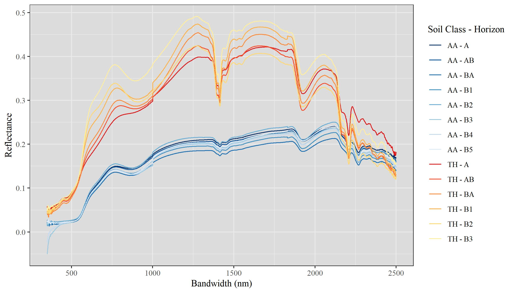
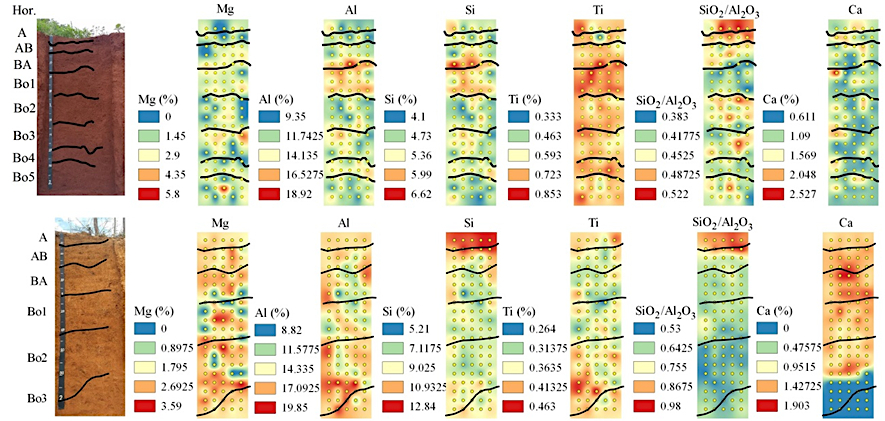

layout: true

```{css, echo = F}
.remark-slide-content {
    font-size: 150%;
    }

.whitecolor {
    color: white;
    }

.footer {
    position: absolute;
    bottom: 0;
    left: 10px;
    font-size: 80%
    }

a {
color: inherit;
}
```

# Solos Brasileiros

---

## Latossolos

A classe de solos mais abundante no Brasil é a dos **Latossolos**.

--

Ela é caracterizada por:
 - Profundidade
 - Intemperismo
 - Homogeneidade **aparente**

---

class: whitecolor
background-image: url(assets/latossolo_perfil_1.jpg)
background-size: 1250px

 - Profundidade
--

background-image: url(assets/latossolo_perfil_2.jpg)
background-size: 1250px

.footer[
Fonte: <a href="https://www.agricultura.pr.gov.br/PronasolosPR/Pagina/ESTRUTURA-EM-LATOSSOLOS-VERMELHOS-DE-ROCHAS-ERUPTIVAS-NA-BACIA-HIDROGRAFICA">PronasolosPR</a>
]

- Intemperismo

--

- Homogeneidade
---

layout: false

class: inverse, center, middle

# São homogêneos quimicamente?
--

.pull-right[...na verdade não]

---

.center[
```{r, echo = F, out.width = "90%"}
knitr::include_graphics("assets/area_de_estudo.jpg")
```

]
---

layout: true

# Metodologia
---

background-image: url("assets/area_de_estudo.jpg")
background-position: right
background-size: 600px

## Área de estudo

 - Latossolo Vermelho e Vermelho-Amarelo
--

 - 2 m de perfil
--

 - 50 cm de largura
--

 - 5 amostras em 20 profundidades
--

 - 100 amostras de cada perfil
--

 - ...para vários atributos de solo
---

layout: false

class: inverse, center, middle

# É muita coisa...?
---

class: inverse

## Alguns atributos químicos solo...
--

### Macronutrientes:
--

 - Ca<sup>2+</sup>
--

 - Mg<sup>2+</sup>
--

 - P
--

 - K<sup>+</sup>

### Micronutrientes:
--

 - Fe
--

 - Mn
--

 - Mo
--

 - Ni
--

 - Cl
--

 - Zn
--

 - E tem mais...
--

background-image: url("assets/too_many_counting.gif")
background-position: 70%
background-size: 500px

---

class: inverse, center, middle

# Alternativas...?
--

.pull-right[...sempre tem]
---

layout: true

# Metodologia

## Sensores próximos
---

class: whitecolor
background-image: url("assets/pxrf_image_1.jpg")
background-size: 1250px

.footer[Fonte: <a href="https://www.olympus-ims.com/en/olympus-xrf-xrd-for-lithium-exploration/">Olympus</a>]

 - Portable X-ray Fluorescence Spectrometer (pXRF)
--

   - Análises rápidas (~1 minuto)
--

   - Detecta elementos entre Mg e U
--

   - Não destrói as amostras
--

   - Não produz rejeitos químicos
---

background-image: url("assets/visnir_image_2.jpg")
background-size: 700px
background-position: 120% 100%

.footer[Fonte: <a href="https://www.alphaomega-electronics.com/en/spectrometers-spectro-radiometers/4040-leaf-clip-spectral-reflectance-leaf-clip.html">AlphaOmega</a>]

 - Visible Near-Infrared Spectrometer (Vis-NIR)
--

   - Análises rápidas (alguns segundos)
--

   - Detecta a reflectância dos objetos
--

   - Faixa do espectro ~350 - 2500 nm
--

   - Não usa reagentes químicos
--

   - Preserva as amostras
---

layout: false
class: inverse, center, middle

# Variação química dentro dos perfis
---

layout: true

# Resultados
---

### Vis-NIR

.center[
```{r, echo = F, out.width = "70%"}

```
]
---

### pXRF

.center[
```{r, echo = F}

```
]
---

layout: false
class: whitecolor
background-image: url("assets/soil_image.png")
background-size: 1250px

# Benefícios
--

### Sensoriamento próximo solos tropicais...

 - Possibilita analisar grande número de amostras em pouco tempo
--
 
 - Capacidade de avaliar variação de muitos atributos
--

 - Estudar solos mais profundos mais facilmente
--

 - Dados muito diversos (diferentes espectros)
--

 - Amostras são reutiizáveis
--

 - Ambientalmente correto
